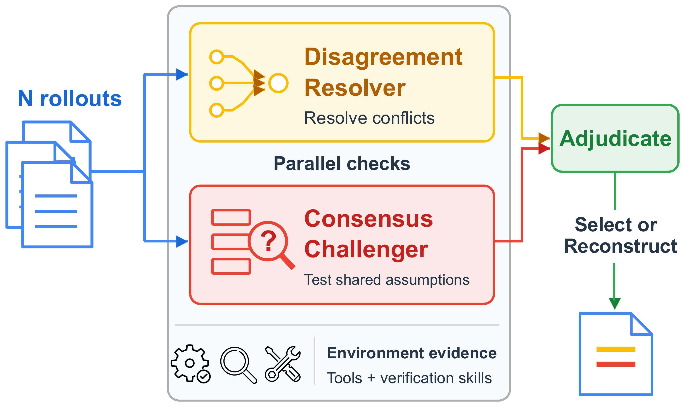
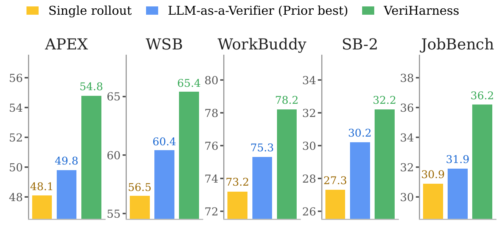
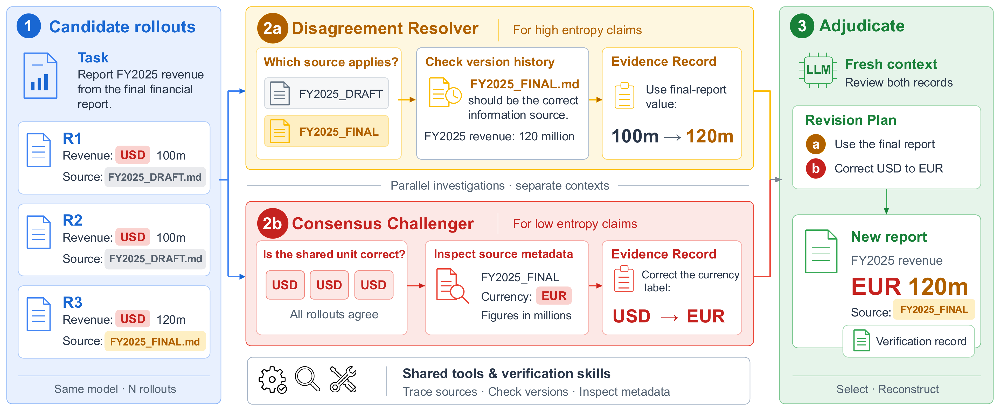

<p align="center">
  
</p>

<h3 align="center">Scaling Agentic Verification for Long-Horizon Tasks</h3>

<p align="center"><b>Same model. Better evidence.</b><br>
Check what agent outputs disagree on, and what they all get wrong. Deliver a better artifact with a record of why.</p>

<p align="center">
  <a href="https://arxiv.org/abs/2610.00972"></a>
  <a href="https://veriharness.com"></a>
  <a href="https://huggingface.co/datasets/caiqizh/veriharness"></a>
  <a href="LICENSE"></a>
</p>

VeriHarness is a verification harness for long-horizon general agents. Given
a task and *N* independent rollouts of the same agent on it, VeriHarness uses
**the same model that generated the rollouts** to check them against the task
environment and to deliver one artifact that is better than a typical rollout,
together with a record of the evidence behind every change.

The verifier is not a stronger judge. Its advantage comes from two sources
only: the structure of the rollout pool, and evidence it actively acquires
from the environment (files, data, recomputable quantities).

## Overview and results

<table>
  <tr>
    <td width="44%" valign="top"></td>
    <td width="56%" valign="top"></td>
  </tr>
</table>

*Left:* the verifier is the generator's own model inside a harness. A
disagreement resolver tests the claims on which the *N* rollouts differ, and a
consensus challenger seeks evidence against the claims they share;
adjudication combines their findings to select and revise the artifact.
*Right:* with Gemini 3.5 Flash as both generator and verifier, VeriHarness
against a single rollout and the best prior
[LLM-as-a-Verifier](https://arxiv.org/abs/2607.05391) on the five benchmarks. Across the five benchmarks and two frontier models it achieves the
highest selection scores among the evaluated baselines, and evidence-backed
revision raises the average gain over a single rollout to 6.2 points with
Gemini 3.5 Flash and 6.4 points with Claude Opus 4.8. The full pool of about 26,000 rollouts behind
these numbers is released (see [Data](#data)).

## Contents

- [Overview and results](#overview-and-results)
- [How it works](#how-it-works)
- [Repository layout](#repository-layout)
- [Setup](#setup)
- [Local models](#local-models)
- [Claude Code as the verifier](#claude-code-as-the-verifier)
- [Usage](#usage)
- [Benchmarks and grading](#benchmarks-and-grading)
- [Data](#data)
- [Isolation](#isolation)
- [Native environments (optional)](#native-environments-optional)
- [Operating notes](#operating-notes)
- [Skills](#skills)
- [Citation](#citation)

## How it works

<p align="center">
  
</p>

Rollouts of one model either disagree on a claim or agree on it, and the two
cases call for different checks:

* **Disagreement → resolve.** The alternatives are already on the table. The
  *resolver* picks the check that best separates them, runs it against the
  environment, and eliminates the candidates the evidence contradicts.
* **Consensus → challenge.** Agreement is not evidence: rollouts share a
  model and therefore blind spots. The *challenger* looks for ways a shared
  value, a shared reading, or a shared omission could be wrong, and tests
  them.

Each task runs four model turns in three mutually isolated sessions:

```
materialized task ──► resolver    (own session) ──► ledger_elim.json
                 └──► challenger  (own session) ──► ledger_fals.json
                              │   (run concurrently; neither sees the other)
                              ▼
                  adjudication (fresh session: both records + task + rollouts)
                              │        └─► finish.json  {base, work[], open[]}
                              ▼
                  delivery (same session) ──► out/deliverables/ + repair.json
```

Adjudication names a **base** rollout, an evidence-backed **revision plan**
(`work`), and the claims the evidence left **unresolved** (`open`). Selection,
revision and reconstruction are one knob: an empty plan returns the base
unchanged, a non-empty plan revises it, and `base: "none"` rebuilds the artifact
from the task inputs.

The program only materializes workspaces, routes files between sessions and
collects outputs. Which claims to examine, which checks to run and when to stop
are the model's decisions. The single programmatic gate is content-blind: a
delivered bundle must contain every file of its base under the same name.

## Repository layout

```
harness/
  cli.ts           command dispatcher (driver, runner, score, materialize, grade, env-derive)
  driver.ts        one task: the four turns above
  runner.ts        many tasks: global work pool with per-model and per-benchmark caps; resumable
  score.ts         score a run against the archived pool (selection and final scores)
  config.ts        locations and model lanes; all host specifics come from the environment
  model/           local backends (Ollama, llama.cpp): HTTP client, preflight, pi registry
  claude/          the Claude Code runtime: turn runner, stream parser, preflight, session environment
  views.ts         plain-text views rendered beside binary artifacts (.cells.tsv, .text.txt)
  prompts/         CHARTER (system prompt), MISSION, the two investigation playbooks and
                   record formats, ADJUDICATE, REPAIR
  skills/          the skill library (evidence-*, resolve-*, falsify-*, repair-*)
  materialize/     adapters that turn a benchmark's archived rollouts into task workspaces
  grade/           wrappers around each benchmark's own grader, for re-grading revised artifacts
  env/             optional native execution environments (task images) and the office/docs images
  scripts/         mount-namespace jail, agent-runtime setup, benchmark setup, local model proxy
  benchmarks/      our grading configuration and credential templates per benchmark
  pi-home/         the agent runtime's model registry (models.json)
```

Development runs the TypeScript sources with [Bun](https://bun.sh). Production compiles them
(`npm run build`) and runs the emitted JavaScript with Node.js 22.19+. Skill CLIs follow the
same split: `bun scripts/<name>.ts` while iterating, `node scripts/<name>.js` (via the launcher)
after a build.

## Setup

Requirements: Linux with unprivileged user namespaces and util-linux `unshare` and `setpriv`
(for the jail), [Bun](https://bun.sh)
1.1+ for development, Node.js 22.19+ for production and the agent runtime, Python
3.10+ (LiteLLM, WorkBuddy/SB2 grade bridges, benchmark setup), git, curl, `uv` (for the
benchmark checkouts), and Docker for the graders and the optional native
environments.

```bash
bun install                          # or: npm install
pip install -r requirements.txt      # remaining Python bridges and setup helpers
harness/scripts/setup_pi.sh          # installs the pinned pi agent runtime into harness/vendor/
```

Harness commands:

```bash
# development (Bun, TypeScript sources)
bun harness/cli.ts driver <task-dir> --provider google-vertex --model gemini-3.5-flash --thinking high
bun harness/cli.ts runner --run-name demo --cells sb2:opus apex:opus
bun harness/cli.ts score runs/demo/sb2_opus --workers 24
bun harness/cli.ts materialize <bench>

# production (Node, compiled)
npm run build
node dist/harness/cli.js driver <task-dir> --provider google-vertex --model gemini-3.5-flash --thinking high
```

The harness drives the open-source [pi](https://www.npmjs.com/package/@danielsimonjr/pi)
coding-agent runtime and works with any model provider pi supports (Anthropic,
OpenAI, Google AI Studio, Vertex AI, OpenAI-compatible endpoints and others);
no Google account or service is required. A *lane*
is the verifier model; by default a pool is verified by the model that
generated it. The four lanes are defined in
`harness/config.ts` (`LANES`) and all run through Claude Code. Edit them or pass
`--provider`/`--model` to the driver to use other models, for example
`--provider anthropic --model claude-opus-4-8` with `ANTHROPIC_API_KEY` set.
The two options below were the lanes of the paper. They stay available as
driver options, but no lane uses them.

* **Gemini on Vertex AI**: pi's `google-vertex` provider with
  application-default credentials (`gcloud auth application-default login`)
  and `GOOGLE_CLOUD_PROJECT` set. The jail exposes `~/.config/gcloud`
  read-only for this purpose.
* **Claude on Vertex AI**: served through a local
  [litellm](https://github.com/BerriAI/litellm) proxy that the runner starts
  on demand (`harness/scripts/litellm_up.sh`, port 4180; the registry entry
  is `vertex-litellm` in `harness/pi-home/models.json`):

  ```bash
  harness/scripts/setup_litellm.sh
  export VERTEX_PROJECT=<your-gcp-project>       # and optionally VERTEX_LOCATION
  ```

* **Local models** (`ollama`, `llamacpp`): no API key. Ollama defaults to
  `http://127.0.0.1:11434`; llama.cpp's `llama-server` defaults to
  `http://127.0.0.1:8080`. The harness checks that the server is up, the model
  is pulled or loaded, and tool calling works, then points pi at that server's
  OpenAI-compatible endpoint. Setup, context length and the failure messages
  are in [docs/local-models.md](docs/local-models.md).

  ```bash
  bun harness/cli.ts model-check --provider ollama --model qwen2.5-coder:7b
  bun harness/cli.ts driver <task-dir> --provider ollama --model qwen2.5-coder:7b --env none
  bun harness/cli.ts driver <task-dir> --provider llamacpp --model model.gguf --env none
  ```

* **Claude Code** (all four lanes: `flash` is `claude-fable-5-1`, `opus` is `claude-opus-5-5`, `haiku` is `claude-haiku-5-5`, `sonnet` is `claude-sonnet-5-5`): the `claude` command-line program,
  signed in on the host, runs each turn. No pi runtime and no API key are
  needed. See [Claude Code as the verifier](#claude-code-as-the-verifier).

The source repository is [danielsimonjr/verify](https://github.com/danielsimonjr/verify)
(renamed from `veriharness`). The package is named `verify`. The command is still `veriharness`,
because cmd.exe runs its built-in VERIFY command before it searches PATH. The environment variables
keep the `VERIHARNESS_` prefix.

Host-specific locations are environment variables (see `harness/config.ts`):

| Variable                                                        | Meaning                                                                           | Default                                             |
| --------------------------------------------------------------- | --------------------------------------------------------------------------------- | --------------------------------------------------- |
| `VERIHARNESS_DATA`                                            | materialized rollout pools                                                        | `./data`                                          |
| `VERIHARNESS_RUNS`                                            | run outputs                                                                       | `./runs`                                          |
| `VERIHARNESS_BENCH_ROOT`                                      | upstream benchmark checkouts and archived rollouts (materialize and grade only)   | unset                                               |
| `VERIHARNESS_TMP`                                             | staging directory for the graders' containers (bind-mounted, so a real directory) | `/var/tmp`, or the operating system's temporary directory when `/var/tmp` does not exist |
| `VERIHARNESS_WB_INDEX`                                        | index of archived WorkBuddy run directories (materialize only)                    | `<bench root>/benchmarks/workbuddy/wb_index.json` |
| `VERIHARNESS_IMAGE_<BENCH>`, `VERIHARNESS_IMAGE_SB2_GRADER` | image overrides (see "Native environments" and`harness/grade/sb2.ts`)           | per bench                                           |
| `VERIHARNESS_OLLAMA_BASE_URL`, `OLLAMA_HOST`                | Ollama server                                                                     | `http://127.0.0.1:11434`                            |
| `VERIHARNESS_LLAMACPP_BASE_URL`, `LLAMA_BASE_URL`           | llama-server                                                                      | `http://127.0.0.1:8080`                             |
| `VERIHARNESS_TEMPERATURE`, `VERIHARNESS_TOP_P`, `VERIHARNESS_MAX_TOKENS`, `VERIHARNESS_CONTEXT_SIZE` | local-model request options                                            | unset (the server must advertise a context window above 4096) |
| `VERIHARNESS_MODEL_TIMEOUT`                                 | preflight HTTP timeout, seconds                                                   | `180`                                               |
| `VERIHARNESS_CLAUDE_BIN`                                    | the `claude` program for `--provider claude-code` (`--claude-bin` overrides it)   | `claude` from `PATH`                                |

`<data>/_worlds/` holds the task environments that accompany the pools: the
APEX world archives and the WorkBuddy task repositories with their image
markers. The materializers link into it, grading and native mode read it, and
the jail exposes it read-only. It is produced together with the pools and is
not part of this repository.

## Local models

Ollama and llama.cpp run next to the hosted lanes. Both need `--model` and neither needs an API key. The harness refuses to start when the server is down, the model is missing, or tool calling does not work, because a verifier turn that cannot call tools does not write a ledger. Details, including context length and the in-process GGUF tradeoff, are in [docs/local-models.md](docs/local-models.md).

```bash
ollama serve && ollama pull qwen2.5-coder:7b
bun harness/cli.ts model-check --provider ollama --model qwen2.5-coder:7b
bun harness/cli.ts driver <task-dir> --provider ollama --model qwen2.5-coder:7b --temperature 0.2 --env none

llama-server -m model.gguf --host 127.0.0.1 --port 8080 --jinja -c 32768
bun harness/cli.ts driver <task-dir> --provider llamacpp --model model.gguf --env none
```

## Claude Code as the verifier

Claude Fable, Claude Opus, Claude Sonnet and Claude Haiku run as the verifier through the `claude` command-line program. The harness uses the login that Claude Code already holds. It sets no credential. Details, including the isolation flags, the session files and the usage-limit behavior, are in [docs/claude-code.md](docs/claude-code.md).

```bash
bun harness/cli.ts model-check --provider claude-code --model claude-haiku-5-5
bun harness/cli.ts driver <task-dir> --provider claude-code --model claude-haiku-5-5 --env none
bun harness/cli.ts runner --run-name demo --cells sb2:haiku --env none --lane-max haiku=4
```

`model-check` prints the CLI version, the model and the credential source.

* `--env none` is required. The jail replaces `$HOME`, so Claude Code finds no login in it, and the containers run pi only. `--env jail`, `native` and `native-full` stop with an error. Without the jail, the verifier's Bash tool runs on the host with the permissions of the user who starts the driver: run it on a host where that is acceptable.
* The `flash` and `opus` lanes start at two concurrent drivers each and the `haiku` and `sonnet` lanes at four, because every Claude Code session of the account counts against one usage limit.
* When Claude Code reports a usage limit, the driver exits with code 75. The runner stops that lane and marks the queued tasks `lane-stopped`.
* Windows is supported for this provider. Install Python 3 with `openpyxl` and `python-docx` for the repair turn.

## Usage

**Task workspace.** Everything the verifier sees is a directory:

```
<data>/<bench>/<pool>/tasks/<task-key>/
  spec/task.md                        the task description
  workspace/                          the task's input files
  rollouts/rNN/deliverables/          what rollout NN delivered
  rollouts/rNN/trajectory/            its execution trace, if available
<data>/<bench>/<pool>/meta.json       archived per-rollout scores; never visible to the verifier
```

`bun harness/cli.ts materialize <bench>` (or `node dist/harness/cli.js materialize <bench>`) builds these from an archive of
rollouts. The adapters encode the archive layout our pools were generated
into; to verify your own rollouts, produce the layout above directly or write
a TypeScript adapter in `harness/materialize/` whose `iterTasks(pool)` generator yields `Task` objects (the `Task` and `Rollout` classes in `harness/materialize/base.ts`).

**Run one task.**

```bash
bun harness/cli.ts driver <task-dir> --provider google-vertex --model gemini-3.5-flash --thinking high
```

The driver writes the two investigation records (`elim/`, `fals/`,
`ledger_*.json`), `finish.json`, `repair.json`, `driver.log`, the model
transcripts under `session/` and the result under `out/deliverables/` into the
task directory. `--contract pick-only` stops
after adjudication (selection only), `--no-skills` runs with an empty skill
library, `--skill <dir>` (or `--skill=<dir>`, like every other option) swaps in another library, `--skills-mode auto` lets the
verifier choose which skills to read (see "Skills"), and `--env none` runs without the jail (debugging only, and required with `--provider claude-code`).

**Run a benchmark.** A cell is one `bench:pool` pair; the runner copies each
task workspace under `<runs>/<run-name>/<bench>_<pool>/` and drives the tasks
through the driver with per-lane and per-benchmark concurrency caps. It is
resumable: finished tasks are skipped, unfinished ones re-staged.

```bash
bun harness/cli.ts runner --run-name demo --cells sb2:opus apex:opus
bun harness/cli.ts score runs/demo/sb2_opus --workers 24
```

`score.ts` reports the single-rollout mean, the selection score, the final
score after revision, and the selection oracle. `--select-only` uses only the
archived scores and needs no grader; otherwise the delivered bundle and the
unrevised base are re-graded in the same pass and
`final = select + (revised − base_regraded)`, so grader drift and judge noise
cancel in the difference.

## Benchmarks and grading

The paper evaluates on APEX-Agents, Workspace-Bench Lite, WorkBuddy Bench,
SpreadsheetBench 2 and JobBench. This repository does not redistribute any
benchmark data, rollouts or images. `harness/scripts/setup_benchmarks.sh`
installs what re-grading needs under `$VERIHARNESS_BENCH_ROOT/benchmarks/`:
each benchmark's own code cloned at the commit the paper's graders were
validated against, its data from Hugging Face, and its environment and
Docker images built with its own tooling.

```bash
export VERIHARNESS_BENCH_ROOT=/path/to/benchmarks-root
harness/scripts/setup_benchmarks.sh sb2 jb          # or: all; --no-images skips the Docker builds
```

| Bench    | Upstream                                                                              | Grader and what it needs at scoring time                                                                                                                                                                                                              |
| -------- | ------------------------------------------------------------------------------------- | ----------------------------------------------------------------------------------------------------------------------------------------------------------------------------------------------------------------------------------------------------- |
| `apex` | [archipelago](https://github.com/Mercor-Intelligence/archipelago) grading runner       | the benchmark's rubric judge with our settings in`harness/benchmarks/apex/`; `GEMINI_API_KEY` (several keys may be comma-separated and are rotated) or `APEX_JUDGE_MODEL=vertex_ai/<model>` with `VERTEXAI_PROJECT` and `VERTEXAI_LOCATION` |
| `wsb`  | [Workspace-Bench](https://github.com/OpenDataBox/Workspace-Bench) `a3a2ee4`          | the benchmark's agent-as-a-judge in its Docker image; judge endpoint in the checkout's`evaluation/.env` (template: `harness/benchmarks/wsb/env.example`)                                                                                          |
| `wb`   | [workbuddy-bench](https://github.com/Tencent/workbuddy-bench) `b516950`              | the benchmark's composite verifier in each task's own image (built per task by the setup script); judge endpoint in the checkout's`.env` (template: `harness/benchmarks/wb/env.example`)                                                          |
| `sb2`  | [SpreadsheetBench-2](https://github.com/RUCKBReasoning/SpreadsheetBench-2) `5c16026` | the official recalculation and cell comparison; LibreOffice in the official image plus`tqdm` (`veriharness-sb2`). The Visualization category is not wrapped                                                                                       |
| `jb`   | [job-bench-eval](https://github.com/Job-Bench/job-bench-eval) `0152c80`              | the benchmark's text judge through an OpenAI-compatible endpoint:`JB_JUDGE_MODEL`, `JB_JUDGE_API_BASE`, `JB_JUDGE_API_KEY`                                                                                                                      |

The three LLM judges (`wb`, `wsb`, `jb`) need an OpenAI-compatible endpoint
that you provide: the `.env` templates default to `http://127.0.0.1:4100` and
`jb` to `JB_JUDGE_API_BASE`; the proxy in `harness/scripts/litellm.yaml` serves
only the verifier lane and can be extended with the judge models.
`harness/grade/<bench>.ts` documents, per benchmark, which upstream entry
point is wrapped. Scoring refuses to start when a judge is unreachable
(`preflight`), because the upstream judges report a failed call as a 0.0 score
rather than an error, and it warns when re-grading the archived bases does not reproduce
their archived scores.

The `harness/materialize/` adapters build task workspaces from the archived
rollout pools of the paper; they document how those pools were produced and
are not needed to verify your own rollouts (see "Task workspace" above).

## Data

The rollout pool of the paper, about 26,000 rollouts of Gemini 3.5 Flash and
Claude Opus 4.8 on the five benchmarks (ten per task), is released on Hugging
Face: [caiqizh/veriharness](https://huggingface.co/datasets/caiqizh/veriharness).
It contains the rendered trajectory the verifier saw and the files each
rollout delivered, with each benchmark's own grader score and a key that maps
to the official task id; no benchmark inputs, rubrics or answer keys are
included, so the task workspaces are rebuilt from the upstream benchmarks
(see the dataset card). `bun harness/cli.ts materialize` is the adapter that
produced the pool from our run archives; to verify the released rollouts,
place them in the task-workspace layout described under [Usage](#usage).

## Isolation

Verifier sessions run inside `harness/scripts/jail_run.sh`, a mount-namespace
jail (`unshare -r -m -p`, no privileges needed): the task workspace is the
only visible project state, `spec/`, `workspace/` and `rollouts/` are
read-only, the rest of `$HOME`, the data root, the run outputs, the benchmark
checkout, `/tmp` and `/var/tmp` are hidden, host Python and Node stay
read-only, and container runtimes are masked. The session runs with no
capabilities, so it cannot undo those mounts. Archived scores and benchmark
answer keys are therefore unreachable from a pi session that runs in the jail.
This does not hold for `claude-code` lanes: they require `--env none`, run
without the jail, and can read other tasks' results, archived grades and the
benchmark answer keys. Scores from those lanes are not protected against
that (see `docs/claude-code.md`). The task workspace and
the repo must not be under `/tmp`: the jail refuses such a path. There is no
network namespace, so model endpoints stay reachable. Graders run on the host
after the verifier batch, never inside the jail.

The four settings of `--env`: `jail` (default), `none` (no isolation: for hosts
without unprivileged user namespaces, or when the data root holds nothing a
session should not see; the driver refuses to start in `jail` mode on such a
host and says so), `native` and `native-full` (next section).

Without the jail, a timed-out turn kills the process group of the agent and every
descendant that is still visible as its child. A descendant that leaves the group with
`setsid` and loses its parent can outlive the turn. In the jail this cannot happen:
`unshare -p -f --kill-child` makes the kernel kill every process of the PID namespace when
the turn ends.

## Native environments (optional)

By default every turn runs in the host jail. With `--env native` the
adjudication and delivery turns run inside a fresh container of the
benchmark's own task image, so the verifier revises the artifact with the
interpreter, libraries and tools the rollouts were produced with; the two
investigations stay in the jail. `--env native-full` runs the investigations
in the image as well. A task without an image falls back to the jail for
every turn. The container sees the task directory at its real path (evidence
read-only), the agent runtime and skills read-only, and the host network,
which is the same exposure the jail has.

```bash
bun harness/cli.ts runner --run-name demo --cells jb:opus --driver-arg=--env --driver-arg=native
```

Images are resolved per benchmark (`harness/env/index.ts`); each can be
overridden with `VERIHARNESS_IMAGE_<BENCH>`:

| Bench           | Default image                                                                                                                                                             |
| --------------- | ------------------------------------------------------------------------------------------------------------------------------------------------------------------------- |
| `wb`          | each task's own exported environment image, or its`vh/<name>` derivative when built with `bun harness/cli.ts env-derive` (the task image plus the harness tool stack) |
| `sb2`, `jb` | `veriharness-office`: `docker build -f harness/env/Dockerfile.office -t veriharness-office .` (on top of the SpreadsheetBench image)                                  |
| `wsb`         | `workspace-bench:local` (the benchmark's image)                                                                                                                         |
| `apex`        | `veriharness-docs`: `docker build -f harness/env/Dockerfile.apex -t veriharness-docs .`                                                                               |

Two things a native setup must provide. Task images carry no JavaScript
runtime, so the agent runs on a self-contained Node.js 22 placed under
`harness/vendor/node-v22/` (the official Linux x64 tarball, 22.19 or later:
`curl -L https://nodejs.org/dist/v22.19.0/node-v22.19.0-linux-x64.tar.xz | tar -xJ -C harness/vendor && mv harness/vendor/node-v22.19.0-linux-x64 harness/vendor/node-v22`). And
a task image must carry the libraries the skills use, or the verifier's
revisions degrade: keep the tool stack in the image, not only the task's own
dependencies (`harness/env/derive.ts` adds it to WorkBuddy's task images).

## Operating notes

* Concurrency: a driver holds up to two model sessions (the investigations run
  concurrently). Lane limits are a shared budget: a second runner on the same
  host must be given the same lane limits (`--lane-max <lane>=N`, repeatable;
  `--max-flash` and `--max-opus` are aliases), since each counts the
  other's drivers.
* Grading containers: `wb` and `wsb` grade in networked containers; churning
  more than about twenty short-lived ones at once destabilises the host's
  network stack. Use `--batch N` where the grader supports it (`wsb`, `sb2`):
  a batch of N bundles is judged in one long-lived container, so
  `--workers 8 --batch 12` grades 96 bundles at a time with eight containers.
  `wb` grades one task per container; keep it to about 12 workers.
* Native mode needs Docker and the benchmarks' task images (WorkBuddy) or the
  images built from `harness/env/Dockerfile.*`; without them the driver keeps
  the jail and says so in `driver.log`. Long-lived task containers scale to
  hundreds without trouble.
* Budgets: `--turn-timeout` (1800 s) caps one model turn, `--task-timeout`
  (3600 s) the whole task; the flash lane on spreadsheet tasks regularly uses
  the full turn budget in an investigation.

## Skills

A skill is a short text (optionally with scripts) describing a reusable
failure mode and how to check for it; skills never contain task-specific
answers. They are organised by phase: `evidence-*` (tools for reading and comparing artifacts;
every phase), `resolve-*` (what evidence settles a disagreement; resolver),
`falsify-*` (how a consensus can be wrong; challenger) and `repair-*` (how to
revise an artifact without breaking it; delivery). Adjudication receives only
the `evidence-*` skills.

`--skills-mode` (driver and runner) selects how skills reach a turn:
`mounted` (default) gives the verifier the skills that apply to the delivered
files; `auto` gives only a catalogue and lets the verifier decide which to
read. The runner records the mode in each cell's `run.json`.

Provenance: the `evidence-*`, `falsify-*` and `repair-*` texts are the
human-authored library of the paper. `resolve-*`, `evidence-patch`,
`evidence-bundle`, `repair-patch` and the `xlsx_gaps` / `xlsx_forks` scanners
were written afterwards from failure analyses of the harness on the paper's
benchmarks, including lessons from the self-evolution experiments on
SpreadsheetBench 2 (only reference-free, benchmark-agnostic procedures were
kept; scripts that filled cells automatically or encoded a benchmark's
reference conventions were not). Those later additions were written from
failures on the same benchmarks the harness is evaluated on: no answers or
reference conventions entered the library, but the failure modes did, so they
are not a held-out test of the library. Each rule is written conditionally on
what the task's own text asks for.

## Citation

```bibtex
@article{veriharness2026,
  title   = {VeriHarness: Scaling Agentic Verification for Long-Horizon Tasks},
  author  = {Zhang, Caiqi and Han, Rujun and Wang, Zifeng and CuiZhu, Zoey and Collier, Nigel and Pfister, Tomas and Lee, Chen-Yu},
  journal = {arXiv preprint arXiv:2610.00972},
  year    = {2026},
  url     = {https://arxiv.org/abs/2610.00972}
}
```

## Contributing

See [`CONTRIBUTING.md`](CONTRIBUTING.md). This project follows
[Google&#39;s Open Source Community Guidelines](https://opensource.google/conduct/);
see [`CODE_OF_CONDUCT.md`](CODE_OF_CONDUCT.md).

## License

Apache 2.0; see [`LICENSE`](LICENSE).

## Acknowledgements

The verifier runs on the [pi](https://github.com/danielsimonjr/pi) coding-agent
runtime (MIT; a fork of [earendil-works/pi](https://github.com/earendil-works/pi)); Claude is served through a local
[LiteLLM](https://github.com/BerriAI/litellm) proxy (MIT). Neither is vendored:
the setup scripts install both. Re-grading uses the benchmarks' own graders: the
[APEX-Agents](https://github.com/Mercor-Intelligence/archipelago) grading runner,
[Workspace-Bench](https://github.com/OpenDataBox/Workspace-Bench),
[WorkBuddy Bench](https://github.com/Tencent/workbuddy-bench),
[SpreadsheetBench 2](https://github.com/RUCKBReasoning/SpreadsheetBench-2) and
[JobBench](https://github.com/Job-Bench/job-bench-eval).

## Disclaimer

This is not an officially supported Google product. This project is not
eligible for the [Google Open Source Software Vulnerability Rewards
Program](https://bughunters.google.com/open-source-security).
